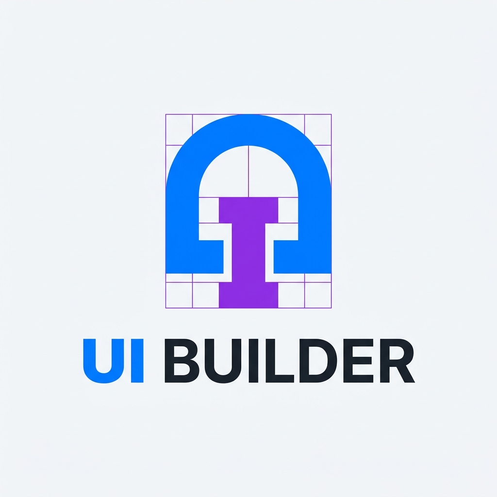

<div align="center">
  
  <h1>UI Builder Theme</h1>
  <p><strong>A modern, minimalist, brutalist-inspired Drupal theme for the UI Builder ecosystem.</strong></p>
</div>

---

## 🏗️ Overview

The **UI Builder Theme** is a custom Drupal administration and frontend theme designed with a striking, unopinionated, brutalist aesthetic. Built to seamlessly pair with the **UI Builder Module**, this theme removes unnecessary clutter, overrides standard Drupal layout conventions, and provides a raw, highly-functional canvas for site builders.

### Key Features
- **Brutalist Design Language:** High contrast, sharp edges, and a "developer-first" aesthetic utilizing `Space Mono` typography.
- **Form Layout Overrides:** Aggressively refactored node edit forms. Moves administrative clutter (meta settings, options, status, and action buttons) strictly to the bottom, prioritizing your main content and UI builder components at the top.
- **Clean Injected Headers:** Features sleek, flexible header regions with custom SVG/PNG logo injection capabilities.
- **Optimized for UI Builder:** Works hand-in-hand with the UI Builder module to deliver a seamless drag-and-drop construction experience.

---

## 🚀 Installation

1. Clone or download this repository into your Drupal installation's custom themes directory:
   ```bash
   cd web/themes/custom
   git clone https://github.com/sauravkashyap/UIBuilderTheme.git ui_builder_theme
   ```

2. Enable the theme via Drush (or the Drupal Appearance UI):
   ```bash
   drush theme:enable ui_builder_theme
   drush config-set system.theme default ui_builder_theme
   ```

3. Clear the Drupal cache:
   ```bash
   drush cr
   ```

---

## 🎨 Theme Structure

- `/css/ui-builder-base.css` - Core typography, variables, and brutalist resets.
- `/css/ui-builder-theme.css` - Layout overrides, specific component styling, form realignments, and responsive grids.
- `/templates/` - Highly customized Twig templates (`html.html.twig`, `page.html.twig`, `node.html.twig`) stripping out default wrappers and injecting UI Builder specific regions.
- `screenshot.png` - The primary logo and theme showcase image.

---

## 🛠️ Requirements
- Drupal 10+
- [UI Builder Module](https://github.com/sauravkashyap/UIBuilderModule) (Highly Recommended)

---

## 📝 License
This project is open-source and available under the MIT License.
